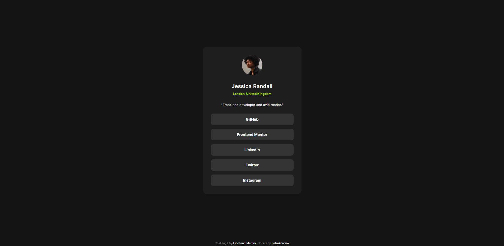
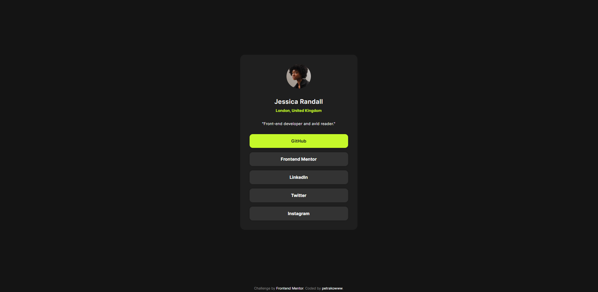
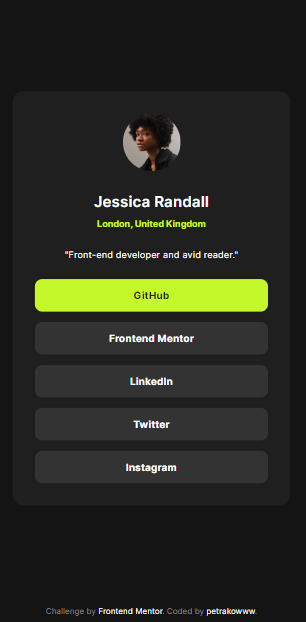

# Frontend Mentor - Профиль социальных ссылок

## Профиль социальных ссылок

Этот проект был выполнен в рамках задания от [Frontend Mentor](https://www.frontendmentor.io).

## Задание

Задача - построить профиль социальных ссылок и сделать его как можно ближе к представленному дизайну.

В рамках этого проекта я реализовал:

- Адаптивный дизайн, который корректно отображается на различных устройствах.
- Эффекты наведения и фокуса для интерактивных элементов.
- Использование SCSS для стилей, включая функцию `clamp` для гибкой адаптации шрифтов и размеров элементов.

## Использованные технологии

- **HTML5**: Для структурирования содержимого страницы.
- **SCSS**: Для стилизации элементов и управления стилями с использованием переменных, вложенности и функции `clamp` для
  адаптивности.
- **CSS**: Скомпилированный из SCSS и использованный для окончательной стилизации страницы.

## Превью

### Для десктопных устройств

### Для мобильных устройств

## Ссылки

- [Frontend Mentor - Профиль социальных ссылок](https://www.frontendmentor.io/challenges/social-media-dashboard-with-theme-switcher-6g3g7j2Qw)
- [Мой GitHub](https://github.com/Petrakoow)